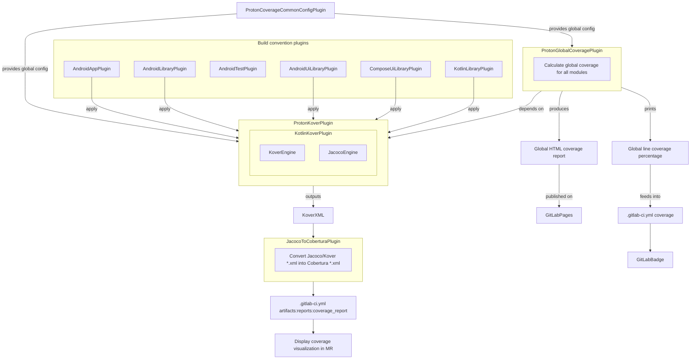

# Proton Coverage plugins

```mermaid
graph TB
ProtonCoverageCommonConfigPlugin -- provides global config --> ProtonKoverPlugin
ProtonCoverageCommonConfigPlugin -- provides global config --> ProtonGlobalCoveragePlugin

subgraph ProtonKoverPlugin
    subgraph KotlinKoverPlugin
        KoverEngine
        JacocoEngine
    end
end

subgraph BuildConventionPlugins[Build convention plugins]
    AndroidAppPlugin
    AndroidLibraryPlugin
    AndroidTestPlugin
    AndroidUiLibraryPlugin
    ComposeUiLibraryPlugin
    KotlinLibraryPlugin
end

AndroidAppPlugin -- apply --> ProtonKoverPlugin
AndroidLibraryPlugin -- apply --> ProtonKoverPlugin
AndroidUiLibraryPlugin -- apply --> ProtonKoverPlugin
ComposeUiLibraryPlugin -- apply --> ProtonKoverPlugin
KotlinLibraryPlugin -- apply --> ProtonKoverPlugin

ProtonKoverPlugin -- outputs --> KoverXML

subgraph ProtonGlobalCoveragePlugin
    globalLineCoverage[Calculate global coverage for all modules]
end

ProtonGlobalCoveragePlugin -- depends on --> ProtonKoverPlugin
ProtonGlobalCoveragePlugin -- produces --> HTMLReport[Global HTML coverage report]
HTMLReport -- published on --> GitLabPages
ProtonGlobalCoveragePlugin -- prints --> GlobalLineCoveragePercentage[Global line coverage percentage]
GlobalLineCoveragePercentage -- feeds into --> GitLabGlobalCoverage[.gitlab-ci.yml coverage]
GitLabGlobalCoverage --> GitLabBadge

subgraph JacocoToCoberturaPlugin
    convert[Convert Jacoco/Kover *.xml into Cobertura *.xml]
end
KoverXML --> JacocoToCoberturaPlugin
JacocoToCoberturaPlugin --> GitlabCoverageReport[.gitlab-ci.yml artifacts:reports:coverage_report]
GitlabCoverageReport --> GitLabMR[Display coverage visualization in MR]
```
